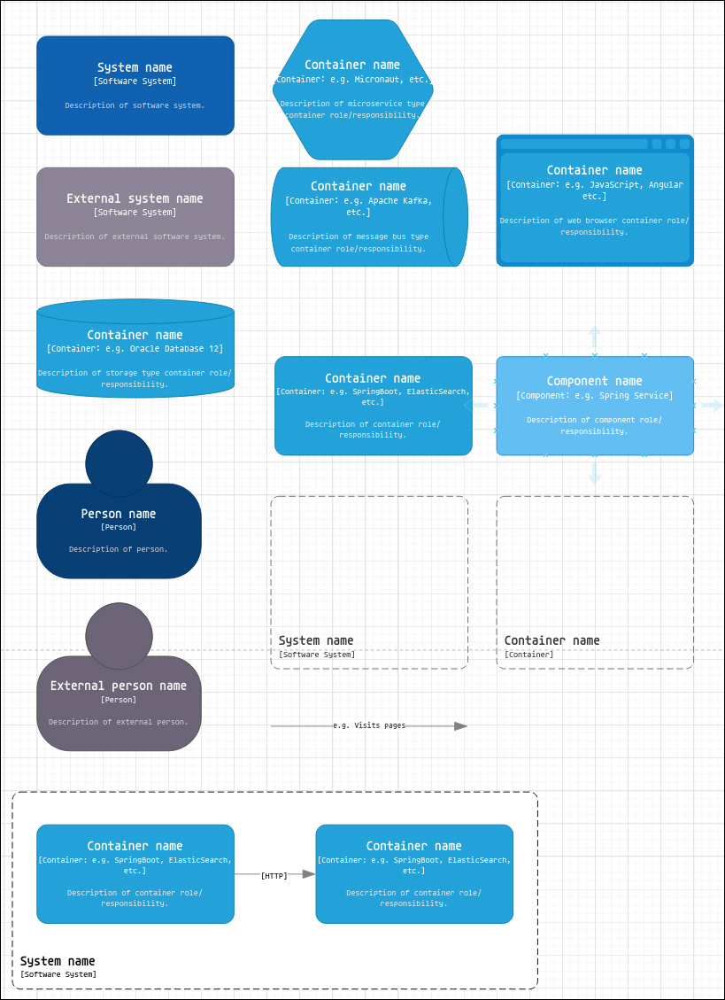

# Draw.io C4 Parser Microservice

## Table of Contents

- [Features](#features)
- [Tech Stack](#tech-stack)
- [Getting Started](#getting-started)
  - [Prerequisites](#prerequisites)
  - [Local Installation](#local-installation)
  - [Docker (Recommended)](#docker-recommended)
- [Configuration](#configuration)
- [API Reference](#api-reference)
- [Data Structure](#data-structure)
- [Data Mapping Example](#data-mapping-example)
- [Implicit Relationship Detection](#implicit-relationship-detection)

## Features

-   **REST API**: Endpoints for both standard Draw.io XML and URL-encoded "paste" data.
-   **Diagram Parsing**: Extracts C4 elements, relationships, and their properties.
-   **Hierarchy Detection**: Infers parent-child relationships from element geometry.
-   **Containerized**: Includes a multi-stage `Dockerfile` for easy deployment.

## Tech Stack

-   **Language**: Clojure
-   **Web Server**: http-kit
-   **Routing**: reitit
-   **Build Tool**: clojure.tools.build
-   **Test Runner**: kaocha
-   **Containerization**: Docker

## Getting Started

### Prerequisites
- [Clojure CLI](https://clojure.org/guides/install_clojure)
- [Docker](https://docs.docker.com/get-docker/)
- `make`
- [httpie](https://httpie.io/docs/cli/installation)

### Local Installation

1.  **Run tests:**
    ```sh
    make test
    ```

2.  **Build the standalone JAR:**
    ```sh
    make uberjar
    ```
    The output will be located at `target/drawio_parser.jar`.

3.  **Run the server locally:**
    ```sh
    make run
    ```
    The server will start on the port defined by `DP_PORT` (defaults to 8080).

### Docker (Recommended)

1.  **Build the Docker image:**
    ```sh
    make docker-build
    ```

2.  **Run the container and test the API:**
    ```sh
    make docker-run
    ```
    This command will start the container, run `httpie` requests to verify the endpoints, print the API responses, and then stop and remove the container.


3.  **Prod mode run the container:**
    This command runs the container in the background, maps port 8090 on your host to port 8080 in the container, and sets the application port using the `DP_PORT` environment variable.

    ```sh
    docker run -d \
        -p 8090:8080 \
        -e DP_PORT=8080 \
        --name drawio-parser-app \
        drawio-parser
    ```

## Configuration

The service is configured via environment variables.

| Variable  | Description                         | Default |
| :-------- | :---------------------------------- | :------ |
| `DP_PORT` | The port for the web server to use. | `8080`  |

For local development, you can create an `.env` file in the project root:
```
# .env
DP_PORT=8080
```

## API Reference

A full OpenAPI 3 specification is available in `openapi.yaml`.

### POST /api/v1/parse/export

Accepts a standard XML file exported from Draw.io.

-   **Example Request (httpie):**
    ```sh
    http POST :8080/api/v1/parse/export < resources/drawio.drawio.xml
    ```

### POST /api/v1/parse/paste

Accepts a URL-encoded string copied from Draw.io ("Extras -> Copy as Text").

-   **Example Request (httpie):**
    ```sh
    http POST :8080/api/v1/parse/paste Content-Type:text/plain < resources/drawio-paste.xml
    ```

## Data Structure

The API returns a JSON object containing `elements` and `relationships`.

```json
{
  "elements": [
    {
      "id": "container-5",
      "name": "API",
      "type": "Container",
      "technology": "Clojure",
      "parent-id": "boundary-1"
    }
  ],
  "relationships": [
    {
      "id": "rel-10",
      "source": "user-id",
      "target": "container-5",
      "technology": "[JSON/HTTPS]"
    }
  ]
}
```

## Data Mapping Example

This section shows how data is transformed from the source XML to the final JSON output.

### 1. Source Draw.io XML

Example diagram 




This is a simplified snippet from a `.drawio` file, representing a single C4 container.

```xml
<object c4Name="API" c4Type="Container" c4Technology="Clojure" id="container-5">
  <mxCell vertex="1" parent="1">
    <mxGeometry x="150" y="150" width="150" height="100" as="geometry" />
  </mxCell>
</object>
```

### 2. Internal Clojure Representation

The parser converts the XML into a Clojure hash map. Note that geometry values are parsed into integers for easier processing.

```clojure
{:id "container-5",
 :name "API",
 :type "Container",
 :description nil,
 :technology "Clojure",
 :application nil,
 :label nil,
 :geometry {:x 150, :y 150, :width 150, :height 100}}
```

### 3. Final JSON API Output

The web handler serializes the Clojure map into a JSON object. Keys are converted to `camelCase` strings, and `nil` values are omitted.

```json
{
    "id": "container-5",
    "name": "API",
    "type": "Container",
    "technology": "Clojure",
    "geometry": {
        "x": 150,
        "y": 150,
        "width": 150,
        "height": 150
    }
}
```

## Implicit Relationship Detection

A parent-child relationship is inferred if an element's bounding box is completely contained within the bounding box of a `SystemScopeBoundary` or `ContainerScopeBoundary` element. If detected, the child element will have a `parent-id` attribute.
